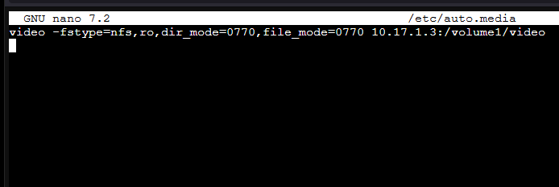

[Reference](https://help.ubuntu.com/community/Autofs)  
Use this application to mount generic file share directories within the proxmox host. 
If you use `/etc/fstab` you risk the host not booting if the network file share is not availabe.

# Installation
```shell
apt-get install autofs
```

Check installation was successful
```shell
systemctl status autofs
```

# Configuration
Modify the following configuration file to suit your needs
```shell
nano /etc/auto.master
```

Add a desired mount point and associated template file
```ini
/mnt/media /etc/auto.media
```


Create the new autofs template
```shell
nano /etc/auto.media
```

Add the desired mounts and folder locations
```ini
#<nested mount folder> -fstype=nfs,rw,dir_mode=0770,file_mode=0770 <server ip>:<nfs path>
video -fstype=nfs,ro,dir_mode=0770,file_mode=0770 10.17.1.3:/volume1/video
```


The mount path for the picture above will be `/mnt/media/video`

Restart the `autofs` service
```shell
systemctl restart autofs
```

Test that the mount works by navigating to the directory which will trigger the mount to be mounted
```shell
ls /mnt/media/video
```

