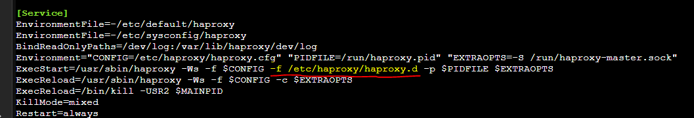

# Installation
https://haproxy.debian.net

# Additional Configuration
- Create a directory to house additional config files
  ```shell
  mkdir /etc/haproxy/haproxy.d
  ```
- Modify the systemd service config to add the additional config directory parameter
  ```shell
  nano /lib/systemd/system/haproxy.service
  ```
  Add the following line `-f /etc/haproxy/haproxy.d` as shown below
  
- Add any additional configuration files to the `/etc/haproxy/haproxy.d` folder

# SSL Certificates
Certificates are stored by default in `/etc/ssl/private`

- Download certificate bundle and send to proxy server
  ```shell
  scp kichka.dev-ssl-bundle.zip root@10.17.1.7:~/kichka.dev-ssl-bundle.zip
  ```

- Unzip
  ```shell
  unzip kichka.dev-ssl-bundle.zip
  cd kichka.dev-ssl-bundle
  ```

- Combine the domain certificate and private key
  ```shell
  cat domain.cert.pem <(echo) private.key.pem | tee kichka.dev.pem
  ```

- Move to final location
  ```shell
  cp kichka.dev.pem /etc/ssl/private/kichka.dev.pem
  ```

- Restart haproxy
  ```shell
  systemctl restart haproxy
  ```
