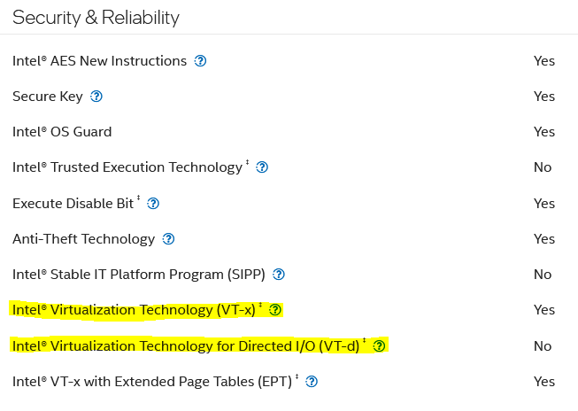
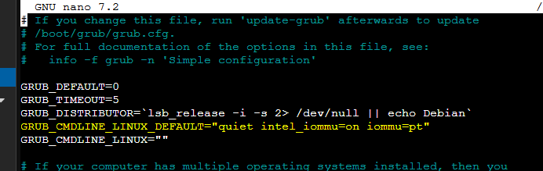
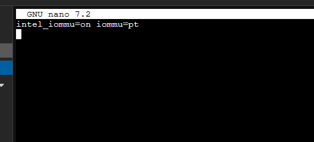
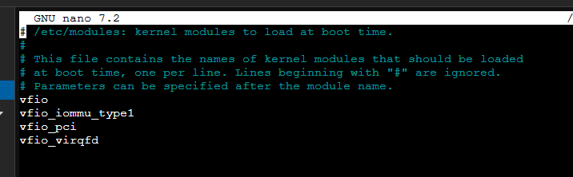
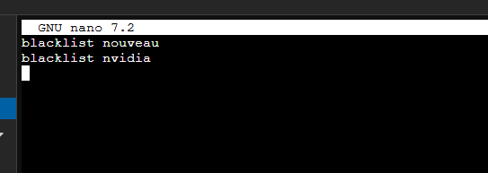
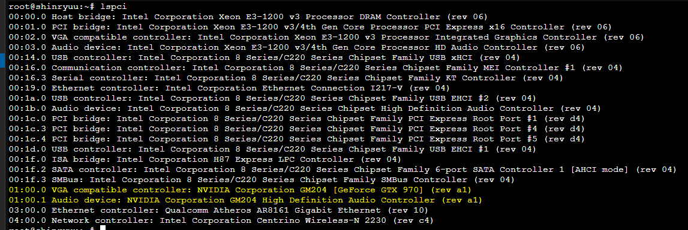
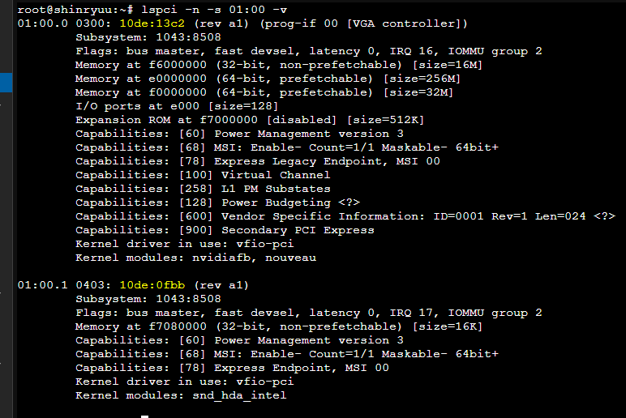
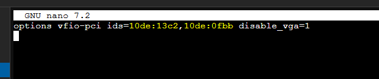
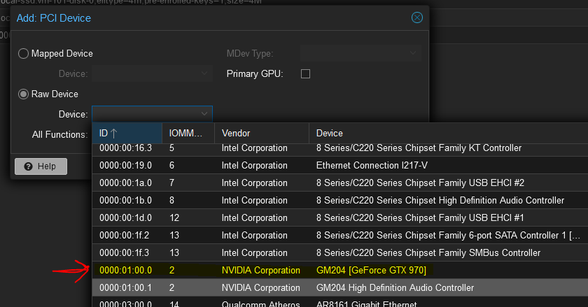

# Proxmox PCI Passthrough

## Requirements
There are a few things to take note before attempting. This guide will not 
inclue any hacky configuration to work around any unsupported features.

### Intel
There are two technogies that _MUST_ to be present for this to work. `VT-x` and `VT-d`.
You can find out if your processor supports these technologies by looking at the spec sheet for
your processor on Intel's website.  
[Example Spec - Core i7 4770k](https://www.intel.com/content/www/us/en/products/sku/75123/intel-core-i74770k-processor-8m-cache-up-to-3-90-ghz/specifications.html)



This processor does not support the `VT-d` technology which is required for `iommu` groups. There are kernel patches that have been created
that can work around this, but they are not guaranteed to work, and also pose security risk as they allow any vm that is sharing a device to
read the others memory. Best to just find a processor that your motherboard supports that supports both technologies.

Both of these technologies will also need to be enable within the BIOS/UEFI settings. Each manufacturer has different names, but if
you look for something like `virtualization technology` or `iommu`, it'll get you on the right track.

### AMD
[TODO]

## Instructions
### Enable IOMMU in Proxmox
There are two different locations to modify depending on how proxmox is booting, but it doesn't hurt to do both if you are unsure.

#### Grub
Edit the grub file
```shell
nano /etc/default/grub
```

Look for the `GRUB_CMDLINE_LINUX_DEFAULT=` configuration value and add `intel_iommu=on iommu=pt` or `amd_iommu=on iommu=pt` depending on your cpu architecture
to the end of what is already there. It should end up looking something like the below.



Save and close the file, then run the following command
```shell
update-grub
```

#### EFI Boot Systems
Edit the cmdline file
```shell
nano /etc/kernel/cmdline
```

At the end of the first line add `intel_iommu=on iommu=pt` or `amd_iommu=on iommu=pt` depending on your cpu architecture. 

**Warning**: _Do not create separate lines!_ Everything in this file *MUST* be on a single line. You may have more in this file
depending on if you are using zfs. In my case it was empty because I am using grub to boot.



Save and close the file, then run the following command
```shell
proxmox-boot-tool refresh
```

### Load VFIO Modules
Edit the following file
```shell
nano /etc/modules
```

Add the following items to this file
```text
vfio
vfio_iommu_type1
vfio_pci
vfio_virqfd
```

Save and close the file. The result should look something like this.



### IOMMU Remapping

Add `options vfio_iommu_type1 allow_unsafe_interrupts=1` to the following file
```shell
nano /etc/modprobe.d/iommu_unsafe_interrupts.conf
```

Add `options kvm ignore_msrs=1` to the following file
```shell
nano /etc/modprobe.d/kvm.conf
```

### Blacklist Graphics Drivers (Optional)
You only need to do this step if the PCI device you want to pass through is a GPU. This will prevent
the proxmox from loading the graphics card allowing you to pass it through to other vm's.

Add any of these options `blacklist radeon`, `blacklist nouveau`, `blacklist nvidia` on separate lines to the following file
```shell
nano /etc/modprobe.d/blacklist.conf
```

This shows blacklisting for an NVidia GPU


### Configure GPU for PCI passthrough
#### Find your GPU
Type the following command into the terminal. This gets you the PCI device number for your machine.
```shell
lspci
```


Once you get the identifier for your GPU, run this command to get the vendor and device id.
```shell
lspci -n -s 01:00 -v
```


Add `options vfio-pci ids=####.####,####.####` to the following file replacing the `####.####` with the vendor/device id.
This is a comma separated list.
```shell
nano /etc/modprobe.d/vfio.conf
```


Apply changes
```shell
update-initramfs -u -k all
```

Reboot the proxmox server
```shell
shutdown -r now
```

### Passing Through to a Virtual Machine
- Ensure that your virtual machine is using the q35 machine type
- Add a raw PCI device by;
  - Selecting your virtual machine
  - Selecting the `Hardware` tab
  - Clicking on `Add` and selecting `PCI Device`
  - Select `Raw Device` and from the device drop down select the device you want to pass through.
  In the case below I selected the root GPU device. You only need to select the base device even if you want the audio device and you 
  can include all functionality by selecting the `All Functions` checkbox.  
  _Note_ that for GPUs specifically you may need to tick
  the `Advanced` checkbox and tick the `PCI-Express` box.
  
- Start the virtual machine and install graphics drivers as normal

### Resources & Troubleshooting
https://pve.proxmox.com/wiki/PCI_Passthrough  
https://forum.proxmox.com/threads/gpu-passthrough-code-43-unable-to-resolve.107996/#post-506721  

