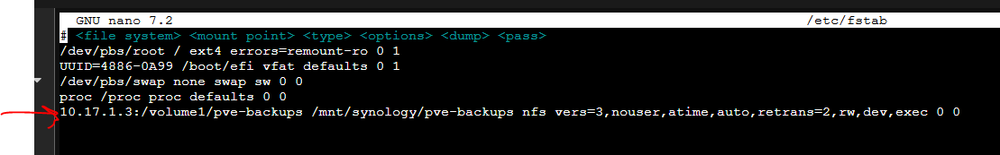

# Storage
Edit the fstab and add the following configuration
```shell
nano /etc/fstab
```
```text
10.17.1.3:/volume1/pve-backups /mnt/synology/pve-backups nfs vers=3,nouser,atime,auto,retrans=2,rw,dev,exec 0 0
```

